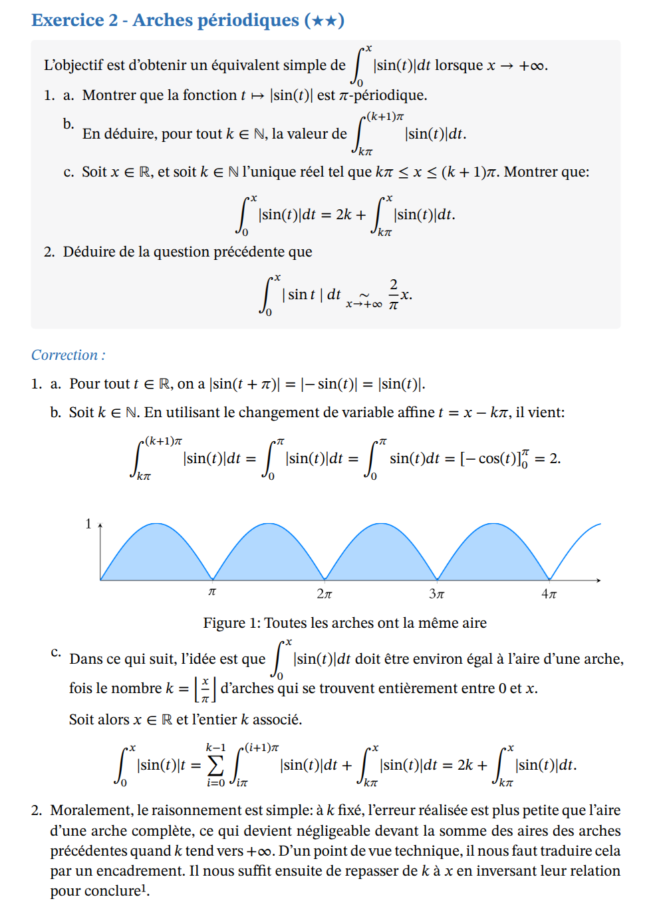

# Colles ECG2 - Mathématiques Approfondies

Exercices de mathématiques pour interrogations orales (appelées *colles*) de deuxième année de classe prépa ECG, filière Mathématiques Approfondies. Ces exercices ont été conçus et donnés aux élèves de la classe ECG2B du Lycée Champollion durant l'année scolaire 2025-26. Ils peuvent cependant être utiles à tout étudiant de mathématiques de niveau 2ème/3ème année dans le supérieur. La difficulté des exercices est indiquée par le nombre d'étoile(s) : applicatif (★), classique (★★) et exploratoire (★★★).
Cette indication est calquée sur les attendus du programme d'ECG et n’a rien d’absolu: ne vous découragez pas pour quelques petites étoiles !

### Thèmes abordés

| Semaine | Thème |
|---------|-------|
| S3-S4 | Révisions d'Analyse |
| S5-S6 | Algèbre Linéaire et Probabilités discrètes |
| S7, S9 | Algèbre linéaire - Éléments propres |
| S10-S11 | Probabilités discrètes |
| S12-S13 | Probabilités - Variables à densité |
| S14 | Réduction et Variables à densité |
| S15 | Algèbre linéaire - Réduction |
| S16 | Produit scalaire, Espaces Euclidiens |

## Un petit exemple

## Contenu

Chaque dossier correspond à une semaine de colles et contient :
- Le sujet complet
- Le sujet agrémenté des corrections détaillées des exercices.
- Le fichier source `.typ`.

## Fichiers sources

Les feuilles d'exercices sont rédigées en [Typst](https://typst.app/), un langage de composition moderne et performant, à l'aide d'un template personnalisé. Pour compiler les fichiers `.typ`, le template est nécessaire : [lien vers le template](https://github.com/placeholder/mh_colle).

## Organisation du dépôt

Le programme de colles s'étale sur deux semaines avec une intersection non nulle entre les thèmes des deux semaines, ce qui se reflète dans les titres des dossiers. **Si deux semaines ont exactement le même titre, consulter la plus récente pour la version la plus complète.**

## Licence

Ces exercices sont librement consultables. Pour toute réutilisation, merci de créditer l'auteur.
